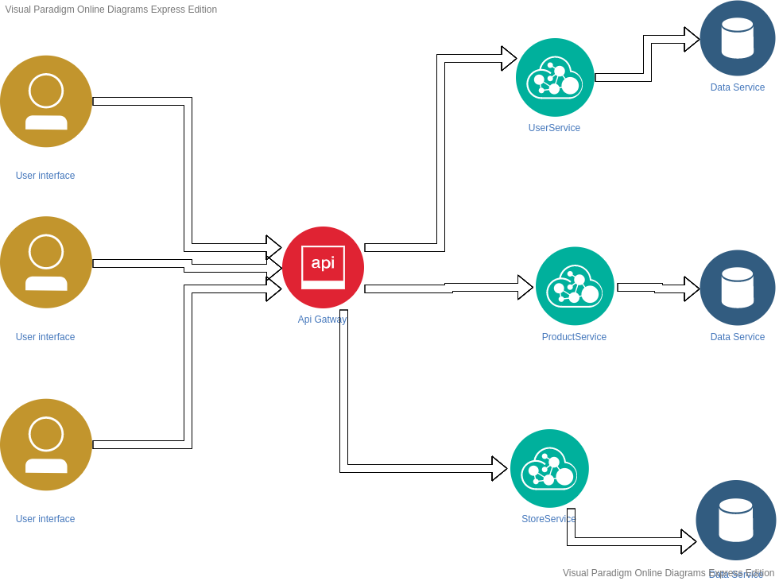

# Generic Microservice Store

Aplicação composta por seguintes serviços:
  * [User](./user) 
  * [Produtos](./product)
  * [Store](./store)

## Tecnologias

* [Docker](https://www.docker.com/) - Isolamento de ambiente
* [Node.js](https://nodejs.org/en/) - Runtime builder
* [Nginx](https://www.nginx.com/) - Http server and proxy reverse
* [MongoDB](https://www.nginx.com/) - Storage

***

## Enviroments

* development
* homolog
* production


## Instalação
``` bash
docker-compose up --build -d
```

## Testes
``` bash
> bash ./scripts/run_tests.sh
```

***

## Arquitetura
